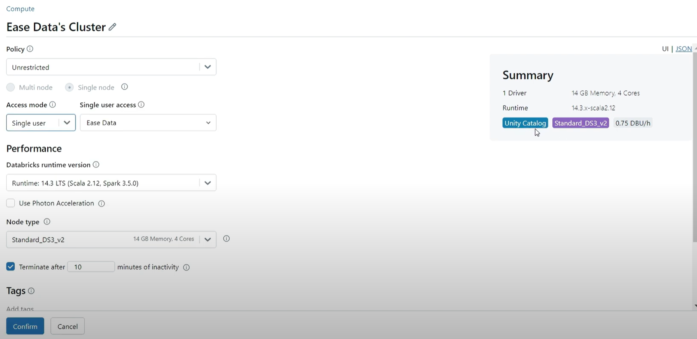

# Lesson 1:
## Databricks Lakehouse


Dataplatform tools and services:
Tools and services required:
- Data Warehousing
- ETL
- Data Lake
- Orchestrating
- Governance
- BI Dashboard

#### Challenge 1: Too many tool stacks
- Databricks Intelligence platform provides Unified solution to handel them.

#### Challange 2: Proprietary Solutions
- Databricks works with, and have developed, Open Source formats to avoid issues related to vendor lock ins

#### Challenge 3: Data Duplication or Silos
- Databricks Data Lakehouse allows to merge the power of Data Lake and Data Warehouse
- Previously you had to have a copy of your data to serve both AI/ETL purposes and a copy in a warehouse to serve the BI requirments. This is now consolidated in databricks Data Lakehosue. 
- This is achived by having an engine, the Delta Lake, on top of your data lake.
- The Delta Lake provides functionality such as; ACRD, Versioning, Transaction log, Restore, audit history.


#### An overview of Lesson 1 


Data Intelligence = Data Lakehouse + generative AI  
Data Lakehouse = Data Warehouse + Data Lake


# Lesson 2:
## Databricks High Level Architecture | Understand Control Plane & Data Plane | Roles in Databricks

Databricks can be served by AWS, Azure and GCP. In Databricks you can havae an account, and this account can then create workspaces (WS). Each account can have several WS. The account governs several aspects of databricks, such as metastore for WS, users, groups and service principles. Workspaces are assigned uniqe IDs, these IDs can be seen in the URLs for the workspaces. 


#### High Level Architecture
Control Plane
- Lies within the databricks cloud account  
- WebApp managed 
- Notebook config.
- Cluster config.
- Job info.

Data Plane
- Lies within customer cloud account
- Client data
- Clusters created

If cluster needs to connect to an external data source or a datalake, the cluster in the data plane will connect to these, not the control plane. The control plane only provides the configurations.

Roles databricks provides:
- Account Administrator
    - Create workspace
    - Metastore management
    - User/permission management
- Metastore Administrator
    - Create catalog/data objects
    - provide delegate to users/owners
- Workspace Administrator
    - admin of a workspace
    - users at workspace level
    - workspace assets
- Owner
    - creator/owner of a table
    - creator/owner of a schema
    - can delegate access/permission to the object


# Lesson 3
## Setup Databricks on Azure | Create your first Databricks Workspace | How to Databricks free trial

Pricing:
- dbu resource usage
- cloud resource usage


In Azure:
- You need at least contributor role at the subscription level
- Databricks is offered in Standard and Premium tiers
- Several differences between standard and premium

A VNet was created manually, CIDR was divided between a public and a private subnet. This is then configured to be used by the Databricks workspace instead of it creating a managed VNET. 


# Lesson 4
## Understand Databricks Account Console | User Management in Databricks | Workspace Management

This UI enables administration of following services:
- Workspaces
- Catalog
- User Management: User, Service Principals and groups are configured here
- Cloud resources
- Previews
- Settings: *Feature enabelment


# Lesson 5
## Databricks Workspace & Notebooks | Cell Magic commands | Version History | Comments | Variables

The workspace admin configures what capability and services are visible/enabled for the user logging into the databricks workspace. This is seen from the Navigation field to the left, and what functionality/services are visible.

Top Section of the workspace Nav bar.
- New
- Workspace
    - All artifacts for the databricks workspace.
    - All users will get a folder created for them
    - Within this view, there are a lot of artifacts available for creation, such as Notebook.
    - You can configure the langague to use in a cell be providing a magic command. 
        - %md = markdown
        - %sh = bash
        - %sql = SQL
    - Comments can be made within a Notebook
    - History of a notebook is captured 
    - Variable store enables to audit variables
    - Python Libraries
- Recents
- Catalog 
- Workflows
- Compute
    - Remember to add termination timeout 
    - Remove Photon to reduce cost 


# Lesson 6 
## How Databricks work with Azure | Managed Storage Container | Databricks clusters using Azure VMs

The managed resource group created during the provision of the Databricks Workspace has either 3 or 4 resources from the get-go.
- A Managed Identity
- A Storage account: this is solely managed by databricks, users do not have direct access to this storage. 
- An Access Connector
- A VNet

When a cluster is provisioned, databricks will create these in the managed azure resource group. On Termination, these are deleted. 


# Lesson 7
## What is Unity Catalog and Databricks Governance | What is Metastore | Unity Catalog Object Model🔥

What is Governance; To make the data secure, awailalbe and accurate. Unity Catalog, is an open source Unified Governance. Define it once, and you can secure it everywhere. It is Centrilized, it provides security, auditing, lineage capability, data discovery and it is open source (available in GitHub).

Before Unity Catalog every workspace had to be administrated individually, now these can be administrated centrally.


# Lesson 8
## Legacy Hive Metastore Catalog in Databricks | What are Managed Table and External Table | DBFS

### HOW TO

In a Notebook in SQL  

##### To Create a Schema:   
```
CREATE SCHEMA bronze
```

##### To Create a Managed Table: 
A managed Table is managed by Table in Metastore, both its Metadata and the Underlying Data files. If you drop the table both the metadata/schema and the data will be gone.
 ```
CREATE TABLE bronze.emp (
    emp_id int,
    emp_name string,
    dept_code string
);
 ```
`bronze.emp` indicates a 2 level namespace.

`describe extended bronze.emp` will present info on the table.  

`INSERT INTO bronze.emp (emp_id, emp_name, dept_code) VALUES (1001, 'Subham', 'D101')` will allow to insert data manually into the table.  

`SELECT * FROM bronxe.emp` will show the data within the table.

It is possible to list the parquet files with the following snippet.
```
%python

dbutils.fs.ls("managed_location")
```

##### To Create an external table
```
CREATE TABLE bronze.emp_ext (
    emp_id int,
    emp_name string,
    dept_code string
)

LOCATION 'dbfs:/tmp/emp_ext'
;
```

`drop table bronze.emp` will drop the table.

What is the difference between an External and a Managed Table:
- If you drop a managed table, both the data and the metadata will be done.
- If you drop an external table, onlye the metadata will be gone.

This means if you, after you have droped an external table, create it again, the data will still persist. Unlike a managed table, creating it again will require to insert the data again.

##### To Create a View

```
CREATE VIEW bronze.emp_vw
AS
SELECT * FROM bronze.emp_ext where dept_code = 'D101'
```
The above is a permanent View, there exists also temporary views and materilized views. A view will run the query you defined the view with once you query that view. 


# Lesson 9
## Enable Unity Catalog and Setup Metastore | How to setup Unity Catalog for Databricks Workspace

To Create a Unity Catalog:
1. Create a Metastore: Metastore is the toplevel container in Unity Catalog
    1. It is recommended to create only one Metastores within a Region. A good practice is to add the name of the region in the metastore.
    2. You will only be able to assigne workspaces within the same region to the metastore.
    3. It is recommended to assigne the `ADLS GEN 2 Path` which is optional. This is the location where all the metadata will be stored across all catalogs. once configured this cannot be changed.
        1. Create a Storage account, enable `Hierarchical namespace`.
        2. Create a Container, name it `root`
        3. Create a directory within that container, name it `metastore`
        4. Create an `Access Connector for Azure Databricks` resource, this is required to give the metastore access to the storage account.
        5. Give the appropriate access to the Access Connector for the stoarge account. From within the Storage account use the IAM and give the access connector the `Storage Blob Data Contributor`. The Access COnnector is a Managed Identity. 
2. After creating the Metastore assigne the metastore to the workspace in order to enable unity catalog

The User who configured the Metastore is the Metastore admin.


# Lesson 10
## Catalog, External Location & Storage Credentials in Unity Catalog |Catalog with External Location

Location in Unity Catalog is inherated. Hence if you define a location at one level, the below levels will by default store data at the same location.   

For each of the levels you can define a location, if you have not defined a location for the above levels, you must configure a location during creation of a table.

This also means if a location is defined for Metstore, defining a location for catalog is optional. 
- Metastore
- Catalog
- Schema
- Table

Catalogs can be created both through UI and SQL (in a notebook). 

To see the information on a catalog in SQL:
```
DESCRIBE CATALOG EXTENDED dev
```
> NB! If you have created a cluster before unity catalog was enabled the above query will give an error: `UC_NOT_ENABLED`.
An easy way to resolve this, is to terminate the cluster, then switch once between the access mode within the edit view of the cluster, then save it as it was. You want to see the tag: Unity Catalog in the cluster summery.



##### To Create a catalog using SQL

```
CREATE CATALOG dev_sql
COMMENT 'This catalog is created using sql'
;
```

##### To drop a catalog using SQL

```
DROP CATALOG dev_sql
```
> NB! This will give an error if there are any schema within the catalog. Hence the schema needs to be dropped first. To drop the schema, the tables within the schema needs to be dropped first.

##### To drop a catalog using SQL recursivly/cascading

```
DROP CATALOG dev_sql CASCADE
```

This will command will go through tables and schemas within a catalog, and drop everything. The CASCADE option can be used for schemas as well.

##### To create a catalog with external location for managed tables

First create an external location in databricks, go to catalog tab and external location. In order to create an external locatino, a storage credential to that location needs to be created. To allow someone to use the storage credential they need to be granted the privilige.

The UI can be used to create an external location, here we will use SQL:
```
CREATE EXTERNAL LOCATION `ext_catalog`
URL 'url to the location'
WITH (STORAGE CREDENTIAL `name_of_storage_credential`)
;
```

To create a catalog with external location for its managed tables
```
CREATE CATALOG dev_ext
MANAGED LOCATION 'url to the location'
COMMENT 'This is an external storage catalog'
;
```

# Lesson 11
## Schemas with External Location in Unity Catalog | Managed Table data Location in Unity Catalog

##### Create schema without external location in dev catalog 

```
CREATE SCHEMA dev.bronze
COMMENT 'This is a schema in DEV catalog without external location'
;
```

##### Create schema without external location in dev_ext catalog

```
CREATE SCHEMA dev_ext.bronze
COMMENT 'This is a schema in DEV_EXT catalog without external location'
;
```

##### Create external location for schema (for its managed tables)

This requires a location to be defined as the external location.

```
CREATE EXTERNAL LOCATION 'ext_schema'
URL 'url_to_external_location'
WITH (STORAGE CREDENTIAL 'name_of_storage_credential')
;
```
##### Create schema with external location in dev_ext catalog

```
CREATE SCHEMA dev_ext.bronze_ext
MANAGED LCOATION 'url_of_external_location/schema_name'
COMMENT 'THIS is schema in dev_ext catalog wtih external location'
;
```

##### Create table raw_sales in all three schemas

```
-- 1. create table in catalog dev without external location
CREATE TABLE dev.bronze.raw_sales(
    invoice_id string,
    cust_id string,
    product_code string,
    qty double,
    price double
); 

-- insert data
INSERT INTO dev.bronze.raw_sales values('INV1001', 'CUST1001', 'PCODE1001', 10, 100);
```
```
-- 2. create table in catalog dev_ext without external location
CREATE TABLE dev_ext.bronze.raw_sales(
    invoice_id string,
    cust_id string,
    product_code string,
    qty double,
    price double
); 

-- insert data
INSERT INTO dev_ext.bronze.raw_sales values('INV1001', 'CUST1001', 'PCODE1001', 10, 100);
```
```
-- 3. create table in catalog dev_ext with external location for schema
CREATE TABLE dev_ext.bronze_ext.raw_sales(
    invoice_id string,
    cust_id string,
    product_code string,
    qty double,
    price double
); 

-- insert data
INSERT INTO dev_ext.bronze_ext.raw_sales values('INV1001', 'CUST1001', 'PCODE1001', 10, 100);
```

By describing the data, we see;
1. For `dev.bronze` the data is stored in managed tables in the defined location of the metastore. 
2. For `dev_ext.bronze` the data is stored in managed tables in the defined location of the catalog dev_ext. 
3. For `dev_ext.bronze_ext` the data is stored in managed tables in the defined location of the schema dev_ext.bronze_ext. 

# Lesson 12
### Managed & External Tables in Unity Catalog vs Legacy Hive Metastore | UNDROP Tables in Databricks

In order to create an external tables, a location needs to be defined in unity catalog as an external location. This external location in turn required a storage credential.

##### Managed VS External tables in unity catalog

```
CREATE TABLE DEV.BRONZE.SALE_MANAGED(
    invoice_id string,
    cust_id string,
    product_code string,
    qty double,
    price double
)
;

-- insert data
INSERT INTO DEV.BRONZE.SALE_MANAGED VALUES ('INV1001', 'CUST1001', 'PCODE1001', 10, 100);
```

```
CREATE TABLE DEV.BRONZE.SALE_EXTERNAL(
    invoice_id string,
    cust_id string,
    product_code string,
    qty double,
    price double
)
LOCATION 'url_of_external_location'
;

-- insert data
INSERT INTO DEV.BRONZE.SALE_EXTERNAL VALUES ('INV1001', 'CUST1001', 'PCODE1001', 10, 100);
```

By printing the info with the `describe` query, we see;
- managed table will be stored in the metastore location
- external table is stored in the external location

What happens after dropping both tables now:
- This is the difference between unity catalog and hivestore. In unity catalog the metadata is dropped but the data is not deleted imediatly, it will get deleted eventually (based on the retention period 7, 30 days)

To see waht tables have been dropped run the following query;
```
USE CATALOG DEV

SHOW TABLES DROPPED IN BRONZE;
```
To undrop the table (within the retention period):
```
UNDROP TABLE DEV.BRONZE.SALE_MANAGED;
```

Incase of external tables: data will never be deleted, it will remain in the storage account. To undrop a table in external location use the query `UNDROP TABLE WITH ID 'uniqe_table_id'`.

> Hence if you accidently drop a table, it is possible to undrop it with unity catalog within the retnetion period.


# Lesson 13
### Delta Tables Deep & Shallow Clones | Temporary & Permanent Views | List Catalog, Schemas & Tables

In order to list available assets the following query can be utilized:

```
SHOW [CATALOGS|SCHEMAS|TABLES] 
```
In order to search based on a substring in the name use: 
```
SHOW [CATALOGS|SCHEMAS|TABLES] in [CATALOG|CATALOG.SCHEMA] LIKE 'substring*'
```

To check for a table in spark/python following can be used:
```
spark.catalog.tableExists('catalog_name.schema_name.table_name')
``` 

##### When table does not exist
This will create the asset only if it does not exist. This can be used for Schemas as well. If "if not exists" is omitted, and the asset does exist, an error will be prompted. 
```
Create table if not exists dev.bronze.emp (
    ...
    ...
    ...
);
``` 

##### Asset history
To get the history of a table you can run: `describe history dev.bronze.emp`. This will output eventsoccured for the table.

##### Asset metadata
To get the metadata of a table you can run: `describe extended dev.bronze.emp`.

##### Create Temporary and Permanent Views

To create a view that will be removed after the cluster is terminated, or the session is ended.
```
CREATE TEMPORARY VIEW emp_temp_vw
AS
SELECT * FROM dev.bronze.emp
WHERE dept_code = 'D101'
;
``` 

To create a view that will not be removed after the cluster is terminated, or the session is ended.
```
CREATE VIEW dev.bronze.emp_vw
AS
SELECT * FROM dev.bronze.emp
WHERE dept_code = 'D101'
;
``` 

To update the view, add the option `CREATE OR REPLACE VIEW`
```
CREATE OR REPLACE VIEW dev.bronze.emp_vw
AS
SELECT * FROM dev.bronze.emp
WHERE dept_code = 'D101'
;
```  

> A view is an abstract for the table you have created. No data is copied anywhere.

##### CTAS (CREATE AS) & DEEP and SHALLOW CLONE

The query `Create TABLE catalog.schema.table_name as select * from catalog.schema.source_table_name` will allow to create a copy of the data in a new location. This table will have its own ID, hence it will be stored in a different lcoation.

DEEP CLONE - clones both metadata and data, will give an exact copy
```
CREATE TABLE catalog.schema.table_name DEEP CLONE catalog.schema.source_table_name
```
What is the difference between a CTAS Table and a DEEP CLONE Table?
- They do the same operation
- Deep Clone is simpler option
- CTAS can loose metadata
- Deep Clone will create exac replica


SHALLOW CLONE - metadata only, the data will point to the source location.
```
CREATE TABLE catalog.schema.table_name SHALLOW CLONE catalog.schema.source_table_name
```
The Shallow Clone command will create a new Table with a uniqe ID, but this table will point to the original table. Hence, no data is copied. The Table points to a spesific verison of the source table. This will ensure new update to the source table wont affect the shallow clone.
Doing changes to the shallow clone will only affect the shallow clone, not the source table. This change will be tracked in the location of the shallow table, and the table will get a new version.


# Lesson 14
## Delta Tables MERGE and UPSERTS | SCD1 in Delta | Soft Delete with Incremental data using Merge

`Merge` in Delta table; Merge is also referred to as `Upsert` which means update or insert. Upsert is also knowen as `SCD1` in datawarehousing terms.  


Capability of the Merge Operation
- Update
- Insert
- capability to do further operations on non matching records.

The following SQL exampel illustrates the use of the merge operation:
```
MERGE INTO CATALOG.SCHEMA.TAR_TABLE tt
USING CATALOG.SCHEMA.SRC_TABLE st
ON  tt.tt_id = st.st_id
WHEN MATCHED THEN
UPDATE SET
tt.tt_value = st.st_value
WHEN NOT MATCHED THEN

--- When schema is matching this can be used
INSERT * 

-- when schema is not matching use below approach
INSERT (
    `COLUMNS`
) VALUES (
    `VALUES`
) 
;
``` 

The following SQL example illustreates the use of merge to delete:
```
MERGE INTO CATALOG.SCHEMA.TAR_TABLE tt
USING CATALOG.SCHEMA.SRC_TABLE st
ON  tt.tt_id = st.st_id
WHEN MATCHED THEN
UPDATE SET
tt.tt_value = st.st_value
WHEN NOT MATCHED THEN
INSERT * 
WHEN NOT MATCHED BY SOURCE THEN
DELETE
;
``` 


The following SQL example illustreates the use of merge to soft delete:
```
ALTER TABLE CATALOG.SCHEMA.TAR_TABLE ADD COLUMN is_cative string;


MERGE INTO CATALOG.SCHEMA.TAR_TABLE tt
USING CATALOG.SCHEMA.SRC_TABLE st
ON  tt.tt_id = st.st_id
WHEN MATCHED THEN
UPDATE SET
tt.tt_value = st.st_value
tt.is_active = 'Y'
WHEN NOT MATCHED THEN
INSERT (
    tt_id,
    is_active
) VALUES (
    tt_id,
    'Y'
) 
WHEN NOT MATCHED BY SOURCE THEN
UDPATE SET
tt.is_active = 'N'
;
``` 


# Lesson 15
## Delta Tables Liquid Clustering and Deletion Vectors | Optimize Delta Tables | Delta Clustering


### Deletion vectors - requires Delta Lake 2.3.0+ or Databricks Runtime (DBR) 12.2 LTS+
By default, when a single row in a data file is delted, the entire Parquet file containing the record must be rewritten With `deletion vectors` enabled for the table, some Delta operations use deletion vectors to mark existing rows as removed without rewriting the Parquet file. Subsequent reads on the table resolve current tab le state by applying the deletions noted by deletion vectors to the most recent table version. 

#### Read CSV file with SQL:   
```
SELECT * FROM
read_files(
    'dbfs:/path/to/csv_file',
    header => true,
    format => 'csv'
);
```

#### Read and Create table from CSV file with SQL:   
```
CREATE TABLE catalog.schema.table_name 
AS
SELECT * FROM
read_files(
    'dbfs:/path/to/csv_file',
    header => true,
    format => 'csv'
);
```

#### Toggle Deletion Vectors OFF/ON with SQL:   
```
--- disable
ALTER TABLE catalog.schema.table_name SET TBLPROPERTIES (delta.enableDeletionVectors = false);

--- enable
ALTER TABLE catalog.schema.table_name SET TBLPROPERTIES (delta.enableDeletionVectors = true);
```

#### Perform Maintainence
To manually ensure deletion vector changes are performed, you can run:
```
OPTIMIZE talbe_name
```


### Liquid clustering - requires Delta Lake 3.1.0+ or Databricks Runtime (DBR) 13.3 ØTS+
Liquid clustering improves the existing partitioning and ZORDER techniques by simplifying data layout decisions in order to omptimize query performance. Liquid clustering provides flexibility to redefine clustering columns wothout rewriting existing data, allowing data layout to evolve alongside analytic needs over time.

Examples that will benefit from LC:
- Tables often filtered by high cardinality columns
- Tables with significatnt skew in data distribution
- Tables that grow quickly and require maintenance and tuning effort
- Tables with access patterns that change over time
- Tables where a typical partition column could leave the table with too many or too few partitions


#### Toggle Liquid Clustering OFF/ON with SQL:   
```
--- enable
ALTER TABLE catalog.schema.table_name CLUSTER BY (column_name);

--- disable
ALTER TABLE catalog.schema.table_name CLUSTER BY (None);
```

#### Read and Create table with Liquid Clustering from CSV file with SQL: 
```
CREATE TABLE catalog.schema.table_name CLUSTER BY (column_name)
AS
SELECT * FROM
read_files(
    'dbfs:/path/to/csv_file',
    header => true,
    format => 'csv'
);
```

### Limitations !
The clustering column selected need to be a column within the first 32 columns of the delta table.


# Lesson 16
## Volumes - Managed & External in Databricks | Volumes in Databricks Unity Catalog |Files in Volume

### Volumns - Requires DBR 13.3 LTS+ & Unity Catalog enabled


#### Create a Volumn
To create a Volumn we will need to have an external location. The external location will require storage credentials. These steps are similar to what we have done in lesson 13.

#### In SQL Create a managed volumn
```
CREATE VOLUMN catalog.schema.volumn_name
COMMENT 'This is a Managed Volumn'
;
``` 
In case of a managed volumn the location does not need to be given, Unity catalog will use what is defined either on schema, catalog or metastore level.  

The same commands for detailed info on table works on volumns:
```
DESCRIBE VOLUMN catalog.schema.volumn_name
```

In python the `dbutils.fs` library can be used to interact with the file.

#### In SQL Create an external volumn
```
CREATE EXTERNAL VOLUMN catalog.schema.volumn_name
COMMENT 'This is an External Volumn'
LOCATION 'path_to_volumn_location'
;
``` 

### How to interact with files in a volumn
In volumns file paths need to have a certaion format. 
`'/Volumn/<catalog_name>/<schema_name>/<volumn_name>/<file_path>'`

### Dropping Volumns
The same rules apply for Volumn as for Tables. If a managed volumn is dropped, both metadata and data is dropped. For external Volumns only the metadata is dropped.

# Lesson 17
## DBUTILS command | Databricks Utilities | Create Widgets in Databricks Notebooks |DBUTILS FS usage

#### File Systems: dbutils.fs
To interact with the filesystem the library `dbutils.fs` cna be used.

#### Widgets: dbutils.widgets
This allows to interact with the code dynamically. Values can be used both in SQL and Python.

NB: Different pattern in SQL based on DBR version 
- DBR 15.1+ uses `${param}`  
- DBR 15.1 and below uses `:param` 

#### Secrets: dbutils.secrets
Provides utilities for leveraging secrets within notebooks.


#### Notebook Utilities: dbutils.notebook
It is possible to run other notebooks, and capture exit values of notebooks. 


# Lesson 18
## Orchestrating Notebook Jobs, Schedules using Parameters | Run Notebook from another Notebook

### Parameterizing Notebooks - Run notebook as a job
Workflow 
- It is possible to create a widgit in a child notebook that accepts a parameter. 
- This parameter can then be assigned to a value in the child notebook for further manipulation.
- The child notebook can during the closing of the notebook return an exit value to the parent notebook.
- The parent notebook can assigne the widgit paremeter of the child notebook when it is run.
- The parent notebook can capture the exit exit value in a variable from the child notebook for logging or further manipulation. 

### Scheduling Notebooks
In the Notebook UI it is possible to schedule the notebook as a workflow.


# Lesson 19
## Databricks Computes - All Purpose & Job | Access Modes | Cluster Policies | Cluster Permissions

### Compute
Compute is the resource that runs the computation. It can take the shape of a single machine or a cluster for more computing power. 

Compute configuration: 
- __Policy__: What restrictions to set on the compute configuration. A policy can also be defined udner policies in Compute.
    - __Unrestricted__: Custom configuration
    - __Personal Compute__: Pre-defined configuration for single user 
    - __Shared Compute__: Pre-defined configuration for multi node with shared mode
    - etc
- __Node__: if the compute is going to have multiple machines or just one
- __Access Mode__: how the machin is going to be accessed:
    - __Single User__: Only one user has access to this, can be configured during provisioning.
    - __Shared__: Multiple users can use this Compute.
    - __No isolation shared__: Unity Catalog is disabled
- __Databricks runtime version__: pre-packaged image of libraries
- __Photon Acceleration__: Runtime engine that Databricks designed in C++. Benefit of faster execution for photon enabled jobs. 
- __Worker Type__: chose compute based on job requirments
    - __Min workers__: Number of minimum workers that should be on at all times.
    - __Max workers__: Number of workers that the cluster can auto scale to. 
- __Driver__: Probably the orchestrating unit for the cluster.
- __Enable autoscaleing__: This is a prerequisite for minimum and maximum options for number of workers.   
- __Terminate after ... minutes of inactivity__: To reduce cost build when compute is idle.

### Job Compute
Computes that are restricted to job runs only. These can be defined and created in workflows.


# Lesson 20
## Custom Cluster Policy in Databricks | Create Instance Pools | Warm Instance Pool

### Custom policies for Clusters
With custom policies you can define cumpute policies. These policies can restrict options. You can also use the policy to enforce updates after a pool is created automatically.

### Pools
This option allows to have warm nodes available for time sensitive jobs.


# Lesson 21
## 


