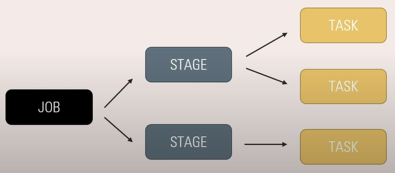

# Lesson 1
## PySpark - Zero to Hero | Introduction | Learn from Basics to Advanced Performance Optimization

### What is Spark

Spark is an Open Source UNified Computing Engine with set of libraries for parallel data processing on compute cluster. It processes data in memory(RAM) which makes it 100 times faster than traditinal Haddop Map Reduce.


# Lesson 2
## How Spark Works - Driver & Executors | How Spark divide Job in Stages | What is Shuffle in Spark



### What are Drivers and Executers
An instructor process is the __Driver__ in a Spark job. A worker process is the __Executor__ in a spark job.

A __shuffel__ is when data is persisted and shared to other executors. 

Driver role:
- Heart of the Spark Application
- Manages the information and state of executors
- Analyzes, distributes and Schedules the work on executors

Executor role:
- Execute the code
- Report the status of execution to driver

# Lesson 3
## Spark Transformations & Actions | Why Spark prefers Lazy Evaluation |What are Partitions in Spark

### What is Partition
To allow executors to work in parallel, Spark breaks down the data into chunks called partitions. 


### What are Transformation
The instruction or code to modify and transform data is knoen as Transformation. Eg. select, where, groupBy etc.
Two types exist: 
1. Narrow Transformation
    - After applying transformation each partition contribute to at-most one partition
2. Wide Transformation
    - After applying transformation if one partition contribute to more than one partition. This type of transformation leads to data shuffle.

### What are Actions
To trigger an execution we need to call an Action (due to lazy evaluation). This executes the plan created by the Transformations.

Three type of Actions exist:
1. View data in console
2. Collect data to native language
3. Write data to output data sources

### What is Spark Session
The Driver process is knoen as Spark Session, this is the entry point for a spark session. The Spark Session instance executes the code in the cluster. Each spark application has its own Spark session.


# Lesson  4
## Spark DataFrames & Execution Plans | Spark Logical and Physical Execution Planning | What are DAG


# Lesson 5
## Understand Spark Session & Create your First DataFrame | Create SparkSession object | Spark UI


# Lesson 6
## Basic Structured Transformation - Part 1 | Write Spark DataFrame Schema |Ways to write DF Columns


### Spark Hands on

`dataframe.printSchema()` will show a tree format schema summary of the dataframe schema.  
`dataframe.schema()` will show the schema through SrtuctType and StructField objects. Also, the column name, the data type and wether it is nullable field is presented.

Exmaple on Spark Schema:
```
from pyspark.sql.types import StryctType, StructField, StringType, IntegerType
schema_string = "name string, age int"

schema_spark = Structtype([
    StructField("name", StringType(), True),
    StructField("age", IntegerType(), True)
])
```

#### DataFrame Schema - Structured Trasnfroamtions - select, expr, selectExpr, cast

Columns and expressions
```
from pyspark.sql.functions import col, expr

col("name") // any mainpulation done on a dataframe is evalauted as an expression

expr("name") // will result as the same as the above line

dataframe.salary // will result in the above

dataframe["salary"] // will result in the same
```

SELECT Columns
```
dataframe_filtered = emp.select(col("column_name"), expr("column_name"), dataframe.column)
```

Show Dataframe
```
dataframe_filtered.show()
```

Using expr for Select
```
dataframe_casted = dataframe_filtered.select(expr("column_name as col_name"), dataframe_filtered.column_name, expr("cast(column_name as int) as column_name_v2"))
```

Using Select + expr = selectExpr
```
df_casted = dataframe.selectExpr("column_name_0 as col_name_0", "column_name", "cast(column_name_1 as int) as col_name_1", "column_name_2")
``` 

Filter 
```
df_filtered = dataframe.select("column_name").where("column_name > 30")
```

Write to csv
```
dataframe.write.format("csv").save("path_to_file")
```

Schema definition through strings
```
schema_str = "name string, age int"

from pyspark.sql.types import _parse_datatype_string

schema_spark = _parse_datatype_string(schema_str)
```


# Lesson 7
## Basic Structured Transformation - Part 2 | Cast Column | Add Column | Static Column Value |Rename

### Spark Hands on

Adding Columns in Spark
```
df_added = df.withColumn("new_column", col("column_name") * 0.2)
// withColumn lets you add or update an old column

// adding several new columns with lit values
columns = {
    "col_0" : lit(0),
    "col_1" : lit(1),
    "col_2" : lit(2),
}

df = df.withColumns(columns)
```

Static values | literals
```
import pyspark.sql.functions import lit

df_new_cols = df.withColumn("col1", lit(1)).withColumn("col2", lit(2)) 
``` 

Rename columns
```
df = df.withColumnRenamed("old_column_name", "new_column_name")
```

Remove columns
```
df = df.drop("column_name", "column_name_1")
```

# Lesson 8
## Working with Strings, Dates and Null | Regex Replace | Convert string to date | Transform NULL

### Spark Hands on

When operation
```
from pyspark.sql.functions import when

df = df.withColumn("col_name", when(col("g") == "m", "M")
                                .when(col("g") == "f", "F")
                                .otherwise(None))
``` 

Convert Date
```
from pyspark.sql.functions import to_date

df = df.withColumn("date_column", to_date(col(date_column), "yyyy-mMM-dd"))
```

NA operations
```
// drop NA
df = df.na.drop()

// replace NA
from pyspark.sql.functions import coalesce, lit
df = df.withColumn("column_name", coalesce(col("column_name"), lit(O)))
// cannot write string directly, need to use literals
```


# Lesson 9
## Sorting data, Union and Aggregation in Spark | Difference in Union and UnionAll | Having Clause

### Spark Hands on


# Lesson 10
## Window Functions, Unique Data & Databricks Community Cloud | Second Highest Salary | Spark expr

### Spark Hands on

Window funtions
```
from pyspark.sql.window import Window
from pyspark.sql.functions import max, col, desc

window_spec = Window.partitionBy(col("column_name")).orderBy(col("column_name_1").desc())
max_func = max(col("column_name_1")).over(window_spec)

df = df.withColumn("max_column_name_1", max_func)
```


# Lesson 11
## Data Repartitioning & PySpark Joins | Coalesce vs Repartition | Spark Data Partition | Joins

### Spark Hands on

#### Partition
Spark operates by data being divided into partitions. To query for the number of partitions a datafram is divided into use: 
```
df.rdd.getNumPartitions()
```
To repartition the dataframe use:
```
df = df.repartition(n_partitions)
```
Coalesce vs REpartitions
Repartition involves data shuffel, wheras Coalsces dosen't. Repartition can increase or decrease partition numbers but, Coalsces can only decrese no increase. Repartition allows unifrom data distribution, but Coalsces can't guaranree it.  

Partition Id
```
from pyspark.sql.functions import spark_partition_id

spark_partition_id // this variable will return the partition id
```

#### Joins


# Lesson 12
## Understand Spark UI, Read CSV Files and Read Modes | Spark InferSchema Option | Drop Malformed

### Spark Hands on

#### Read CSV Data
Spark can read from a csv file. Reading in Spark is a transformation, not an action. Hence, when performing a read on a csv file, spark should not run a job. However, spark will run a single task in order to acquire metadata. Depending on what options are enabled, spark will acquire more metadata, for instance; schema inference.

```
df = spark.read.format("csv").option("header", True).options("inferSchema", True).load("file/path")
``` 

If schema is defined during data load, spark will not perform a job during load. Since no metadata is required. This is importent in production systems to reduce overhead.
```
_schema = "..."

df_schema = spark.read.format(csv).schema(_schema).load("file/path")
```

#### Mode in data load

Mode is an option during data load that will allow to configure data load behaviour. This option requires the schema to be defined pre load. Modes that exist: [PERMISSIVE, DROPMALEFORMED, FAILFAST]

Spark has an inbuilt column `_corrupt_record`, with datatype string, which must be defined during schema definition for it to be used. Howver the column name is not mandatory, this can be given a custom value in an option statement.

PERMISSIVE   
By defualt the PERMISSIVE mode is used. When `_corrupt_record` is defined in the schema, spark will populate this with the corrupt records.
```
df_p = spark.read.format("csv").schema(_schema).option("header", True).load("file/path")

// renaming the _corrupt_record column name. The chosen name needs to be defined in the schema.
df_p = spark.read.format("csv").schema(_schema).option("header", True).option("columnNameOfCorruptRecord", "bad_record")load("file/path")
```

DROPMALEFORMED  
This mode will drop the records that have bad_records.
```
df_m = spark.read.format("csv").schema(_schema).option("header", True).option("mode", "DROPMALEFORMED").load("file/path")
```

FAILFAST   
In the other examples either the bad_record was included, or it was dropped. Eitherway the job ran without an error. FAILFAST mode will fail the job as soon as a Bad Record is identified.
```
df_f = spark.read.format("csv").schema(_schema).option("header", True).option("mode", "FAILFAST").load("file/path")
```

#### Multiple options
The `options()` function can be used alongside multiple values to reduce the verbose configuraiton. 
```
_options = {
    "asd":"asd",
    "asd":"asd",
    "asd":"asd"
}

df = (spark.read.format("csv").options(**_options).load("path/to/file"))
```


# Lesson 13
## Read Complex File Formats | Parquet | ORC | Performance benefit of Parquet |Recursive File Lookup

### Spark Hands on

#### Data formats

Parquet
```
df = spark.read.format("parquet").load("path/to/file")

// incase of folder with several parquet file parts
df = spark.read.format("parquet").load("path/to/parent/folder/*.parquiet")
```

ORC
```
df = spark.read.format("orc").load("path/to/file")

// incase of folder with several ORC file parts
df = spark.read.format("orc").load("path/to/parent/folder/*.ors")
```

#### Columnar Benefits - Both ORC and Parquet  
You will gain execution time efficiency when selecting only required amount of columns.


# Lesson 14
## Read, Parse or Flatten JSON data | JSON file with Schema | from_json | to_json | Multiline JSON

### Spark Hands on

#### JSON
The json data can be on a single line (single line json), or over multiple lines (multi line json).

```
df_singleLine = spark.read.format("json").load("path/to/file")

df_multiLine = spark.read.format("json").option("multiLine", True).load("path/to/file")
```
Schema enforcment
```
_schema = "..."

df_schema = spark.read.format("json").schema(_schema).load("path/to/file")
``` 


# Lesson 15
## How Spark Writes data | Write modes in Spark | Write data with Partition | Default Parallelism

### Spark Hands on

#### Write in Spark
In Spark data is written to file in the partitions it is divided in. When a file is written, a folder is created and then each partition is written in a seperate "part" file, within that folder.   

To get the number of cores available for the spark session use: `spark.sparkContext.defaultParallelism`. 

To get the number of partitions the data is divided in use: `dataframe.rdd.getNumPartitions()`.

Writing the data:
```
// writing to parquet
df.write.format("parquet").save("path/to/file")
// this will create a folder, and each partition will create as many parts/files.

// we can add the partition id 
from pyspark.sql.functions import spark_partition_id
df.withColumn("partition_id", spark_partition_id())
```

#### Write modes
APPEND - Data will always be added, no changes to previous data is made.

OVERWRITE - Data will always be overwritten. Spark will clean the folder then write the new data.  

IGNORE - Will check if data is available, if yes nothing will be done, otherwise the data will be written.  

ERROR - If data exist the job will fail.

#### One output file
To get one file with spark, the repartition function can be utilized.
```
df.repartition(1).write.format("csv").option("header", True).save("path/to/file")
```
Rnemaing is not possible with PySpark

# Lesson 16
## Understand Spark Execution on Cluster | Cluster Manager | Cluster Deployment Modes | Spark Submit

### Spark Hands on

Spark Executors are not the same as a spark node. Executors have various cores, and these cores are worker nodes. 


# Lesson 17
## User Defined Function (UDF) | How Spark works with UDF | How to register Python UDF

### Spark Hands on

#### UDF - User Defined Functions
In a spark application/cluster when runnning an UDF it is important to understand how the function is ran. The spark driver will copy the UDF to each individual worker node, when this is available the worker node will spinn up a python process. The process will then recieve the data from each node, which by this point has been serialized in a format python understands. The data will be run row by row. When the process has been finished the result will be returned to the JVM process.   
The Spark engine does not have control over the python process (as this lies outside the JVM process), hence if the process exceeds any limits this will not be handled by the spark session. For instance, this can lead to memoryOutOfBounds error.  

Important to note:
- Data needs to be serialized and deserialized (to and from python process)
- Costly python process needs to be spinn up
- Data needs to be processed row by row

How to replace python UDFs:
- Use higher order functions
- Write UDF in Java/Scala, as this is already available in the JVM


#### UDF Code Implementation
The below code will make the UDF available for the dataframe API.
```
// some custom function
def add(x, y):
    return = x + y

// register UDF
from pyspark.sql.functions import udf

add_udf = udf(add)

// use udf
df.withColumn("udf_column_name", add_udf("column_name1", "column_name2"))
```

Make the UDF available for Spark SQL or Spark SQL expressions.
```
// how to register the udf
spark.udf.register("add_sql_udf", add, "double") // parameters: name, function, return data type 

// use it with expr
from pyspark.sql.functions import expr

df.withColumn("udf_column_name", expr("add_sql_udf(column_name1, column_name2)"))
```

NB: python UDFs are very expensive, use it if strictly needed.


#### Workflow of creating an UDF in Scala/Java
1. Write the function in either
2. Register the udf
3. Use the UDF with expr()


# Lesson 18
## Understand DAG, Explain Plans & Spark Shuffle with Tasks |Skipped Stage |Benefit of Shuffle Write

### Spark Hands on

The DAG (Directed Ascyclic Graph) for a dataframe can be printed by running `df_sum.explain`. To read the explain plan, you need to read it from bottup up.


# Lesson 19
## Understand and Optimize Shuffle in Spark

### Spark Hands on


#### Benchmarking - noop
When wanting to evaluate the performance of a sequence of PySpark operation that ends with a write action, it is possible to run it using `noop`. This will not write/save the data anywhere, but it will run through all operations and capture performance metrics.
```
df.write.format("noop").mode("overwrite").save  ()
```   

#### Spark Partitions
Spark by defualt when reshuffeling will use 200 partitions. It is possible to configure the defualt number. 
```
// Check Spark Shuffel Partition setting
spark.conf.get("spark.sql.shuffel.partitions")

// Set the Spark Shuffel Partition setting
spark.conf.get("spark.sql.shuffel.partitions", n_partitions)
```

What is the appropriate configuration on the shuffel partitions?
- Depends on the job. Too few partitions can lead to extensive write and read on shuffel, which can turn into a bottleneck. This could aslo lead to "out of memory errors" due to too many writes during a shuffel. 

#### Partitioned Data
Properly partitioned data can result in performance advantages when read in PySpark as data partitions can be divided among available shuffle partitions.

#### Best practices
1. Always try to work with good shuffle, try and reduce number of shuffles as it is a costly operation.
2. Repartition your data, make sure yur data is properly partitioned.
3. Filter yur data as early as possible, this will reduce the amount of data shuffled.


# Lesson 20
## Data Caching in Spark | Cache vs Persist | Spark Storage Level with Persist |Partial Data Caching

### Spark Hands on
#### Data Persistence

The caching operation is a Transformation type operation, not an Action. Hence, to achive Caching, an action needs to be performed. When caching `Count()` or `Write()` is preferred, as these will scan the entire dataframe, resulting in proper caching.  
```
// How to cache a dataframe
df.cache()

// Adding an Actions to the Cache
df.cache().count()  // Default behaviour = MEMORY_AND_DISK

// Remove the cache
df.unpersist() // this is an Action operation
```

The cache can be configured in various modes. If there is not enough memory the cache will be written both on Disk and Memory (this is if default configurations are selected.). 

#### Data Lineage and Cache
Spark keeps track of data lineage. This can be tested by caching a dataframe that is based on a source dataframe. Then performing some read on the source dataframe, this operation will read from the cached dataframe instead of the source dataframe.   
A partial match on the cached data will enforce a complete scan of the source data. This requires carefull cache configuration, otherwise there is a risk of inefficient cache processing. 

```
// Cache some data
df_cache = df.cache()

// Perform the cache through an Action operation
df_cache.count()

// Verify cache is read, and not source dataframe 
df.where("column_name > n").show()
```

#### Data Caching Storage Levels
The storage level can be configured for each cache instance with the `persist()` function. 
```
import pyspark

// configure storage level
df_persist = df.persist(pyspark.StorageLevel.MEMORY_ONLY) // MEMORY_ONLY can be switched for the storage level desired

// Add Cache
df_persist.write.format("noop").mode("overwrite").save() // "noop" flag will ensure write is run, but nothing is written.

// Unpersist the cache
df_persist.unpersist()
```

NB. When caching with `persist()` the data will be serialized, while caching with `cache()` will save the data as deserialized. When data is serializing and the storage level is set to MEMORY it is important that the data fits in memory, otherwise a memory out of bounds error will be throwen. 

#### Global Cache Clear
```
spark.catalog.clearCache()
```


# Lesson 21
## Broadcast Variable and Accumulators in Spark | How to use Spark Broadcast Variables

### Spark Hands on
#### Distributed Shared Variables

Motivation behind `Broadcast Variables`: For instanse, when wanting to enrich a dataframe by its relation with another table, there are several approaches:
1. Join tables, with the risk of performing a shuffle (which is expenisve)
2. Add the data with a lookup function in a UDF, the data will be serialized and deserialized when the udf is run row by row (which is expenisve)
3. Broadcast Variable/Distributed Shared Variable: Sent to each executor and cached there.

#### How to broadcast variable
```
broadcast_variable_name = spark.sparkContext.broadcast(variable_to_be_broadcasted)

// get type of variable
type(broadcast_variable_name)

// get value of variable
broadcast_variable_name.value
```

#### How to use a broadcast variable
```
from pyspark.sql.functions import udf, col

@udf
def get_broadcast_variable(variable_index):
    return broadcast_variable_name.value.get(variable_index)


dataframe_result = dataframe.withColumn("broadcast_var", get_broadcast_variable(col("some_index_id")))
```

#### Accumulators - distributed shared variable
Accumulators allow for the capability to save work done for each executor and then use these values when an aggregate value is required. This reduces the need to shuffle the data in one executor to aggregate over the data.   

```
// Without accumulator
from pyspark.sql.functions import sum

df_sum = df.where("some condition").groupby("column_name").agg(sum("column_name"))

// With Accumulator
df_acc = spark.sparkContext.accumulator(0) // 0 is the default value - evaluate based on what you want to resolve for

def calculate_column(column_id, column_name):
    if "some condition":
        df_acc.add(column_name)

df.foreach(lambda row : calculate_column(row.column_id, row.column_name))

// Get the accumulator value
df_acc.value
```


# Lesson 22
## Optimize Joins in Spark & Understand Bucketing for Faster joins |Sort Merge Join |Broad Cast Join

### Spark Hands on
#### Optimize Joins
Joins in Spark is prone to inefficiencies due to partitions. Depending on how the data is read/partitioned, joins might require data read, shuffle, join, and then an action operation. 

#### Join Strategy -  ShuffleHash
1. Shuffle data
2. Smaller dataset hashed
3. Hashed dataset will be matched with big dataset
4. Joining will take place

This approach is a reliable approach when one dataset that is smaller/hashable/fits in memory.


#### Join Strategy - Sort Merge
1. Shuffle both datasets
2. Sort keys of datasets
3. Merge

Sort is an expensive operation. This join strategy is used when both the datasets are large.

#### Join Strategy - Broadcast
This strategy will give a performance benefit if at least one dataset can be broadcasted. No shuffle step.

1. Smaller dataset is broadcasted
2. Join hash  Broadcast

This approach is viable for when there is a big and a small dataset. Default value of the smaller dataset should be 10Mb, it can be increased to 8Gb. A large dataset can result in a memory out of bounds error. Be vary of this.

How to
```
// Regular Join 
df_joined = df_big.join(df_small, on=df_big.id==df_small.id, how="left_outer")

// Broadcast Join 
from pyspark.sql.functions import broadcast

df_joined = df_big.join(broadcast(df_small), on=df_big.id==df_small.id, how="left_outer")

// SortMerge without buckets
df_joined = df_big1.join(df_big2, on=df_big1.id==df_big2.id, how="left_outer")
```

#### Bucket strategy
Bucketing the data can result in performance benefit during joining of data. To bucket means to divide the data into seperate partitions. Doing the same based on the same KEY, can allow to read bucket data within the same executors, and hence avoid shuffling during joins.

```
// Bucketing during write
df.write.format("csv").mode("overwrite").bucketBy(n_buckets, "column_to_bucket_by").option("header", True).option("path", "path_to_file").saveAsTable("df_bucket")
```

Performing a join on the data bucketed, will result in perfomance increase as this avoids shuffling data.


# Lesson 23
## Static vs Dynamic Resource Allocation in Spark | Dynamic Allocation vs Databricks Scale up

### Spark Hands on
#### Resource Management on Cluster
- Static Allocation; when one application blocks all the resources.
- Dynamic Allocation; resources will scale up and down based on usage. Dynamic allocation is not enabled by default.

```
// To enable dynamic allocation these configurations need to be set
.config("spark.dynamicAllocation.enabled", True)
.config("spark.dynamicAllocation.minExecutors", 0)
.config("spark.dynamicAllocation.maxExecutors", 5)
.config("spark.dynamicAllocation.initialExecutors", 1)
.config("spark.dynamicAllocation.shuffleTracking.enabled", True)
.config("spark.dynamicAllocation.executorIdleTimeout", 60s)
.config("spark.dynamicAllocation.cachedExecutorIdleTimeout", 60s)
```


# Lesson 24
## Fix Skewness and Spillage with Salting in Spark | Salting Technique | How to identify Skewness

### Spark Hands on
# Skewness
__Skewness__ in data is when a significant amount of the data can be assigned to one group. In joining a data based on ids, if the id column has the skew characteristics, Spark might have to perform significantly more joining for some ids vs others. This in turn can result in spillage og data. 

__Spillage__ in spark occures when the data does not fit in memory and needs to be written to disk. This results in inneficient processing, as data needs to be serialized and deserialized. Resulting in higher IO costs.

__Salting__ is a technique that allows us to partition the data evenly. This requires to add salt in the column that feature the skewness. This in practice meanse to add a suffix to the key and convert these keys in uniqe new partitions that result in evenly divided keys.

```
// Prepare Salt
import random
from pyspark.sql.functions import udf

// UDF to return a random number every time and add to dataframe_join1 as salt
@udf
def salt_udf():
    return random.randint(0,16)


// salt data frame to add to dataframe_join2
salt_df = spark.range(0, 16) // keys to match number of partitions


// salt dataframe_join1
from pyspark.sql.functions import lit, concat

salted_df_join1 = dataframe_join1.withColumn("salted_key", concat("key", lit("_"), salt_udf()))

// salt dataframe_join2
salted_df_join2 =  dataframe_join2.join(salt_df, how="cross").withColumn("salted_key", concat("key", lit("_"), salt_udf()))

// join with salt
joined_df = salted_df_join1.join(salted_df_join2, on=salted_df_join1.salted_key==salted_df_join2.salted_key, how="left_outer")

// check partitions distribution
from pyspark.sql.functions import spark_partition_id, count

part_df = joined_df.withColumn("partition_num", spark_partition_id()).groupby("partition_num").agg(count(lit(1)).alias("count"))

part_df.show()

```

NB. Skewness resolved with salting technique is not reccomended everywhere. Only when experiencing memory issues due to spillage, salting is an option!


# Lesson 25
## AQE aka Adaptive Query Execution in Spark | Coalesce Shuffle Partitions | Skew Partitions Fix

### Spark Hands on
#### Adaptive Query Execution
AQE provides several functionalities that enhances the performance of spark:

1. Coalescing post shuffel - remove unecessary shuffel partitions; this allows spark to automatically fit the number of partitions to the job post shuffle, instead of the default 200 partitions.

2. Skewed join optimization (balance partition size) - join smaller partitions and split bigger partitions.

3. Fix partition size to avoid skew; It is possible to manually set the thresholds for when spark should consider a partition as skewed. Both the minimum and the maximum size can be set, default values are 64MB and 245MB. 

4. SortMerge to Broadcast Join; AQE will automatically convert sort merge join to broadcast join for smaller datasets.


# Lesson 26
## Spark SQL, Hints, Spark Catalog and Metastore | Hints in Spark SQL Query | SQL functions & Joins

### Spark Hands on
#### Spark SQL
```
// show database
db = spark.sql("show databases")
db.show()

// show tables
spark.sql("show tables in default").show()

// register dataframes as Views
dataframe.createOrReplaceTempView("dataframe_view") // will create session views, will be removed when session is ended
```

Multipline query in spark, requires 3x "
```
spark.sql("""
    select * from dataframe_view
    where some_condition
""").show()
```

Create a new Column
```
spark.sql("""
    select d.*, date_format(date_column, 'yyyy') as date_column_year from dataframe_view d
    where some_condition
""")
```

Create temp view
```
var_name = spark.sql("""
    select d.*, date_format(date_column, 'yyyy') as date_column_year from dataframe_view d
    where some_condition
""")

var_name.createOrReplaceTempView("temp_view")

// show data from temp_view
spark.sql("select * from temp_view").show()
```

HINTS in Spark.sql(); to give hints in sql queries you need to give the hin like so /*+ HINT */   

To persist the catalog (metadata of the data) spark needs to be configured with hive. Otherwise the catalog will be dropped by default as it is in memory.


# Lesson 27
## Read and Write from Azure Cosmos DB using Spark | E2E Cosmos DB setup | NoSQL vs SQL Databases

### NoSQL database - Azure Cosmos DB


# Lesson 28
## Get Started with Delta Lake using Databricks | Benefits and Features of Delta Lake | Time Travel

Deltalake offers many capabilities, four of the most important features are the following:
1. __ACID Transactions__
    - __Atomicity__ - Single, indivisible unit of work
    - __Consistency__ - Consistent database state
    - __Isolation__ - Concurrent transactions without interferrance 
    - __Durability__ - Permanent change, tolerates system failure 
2. __Time Travel__ - Access/recert to ealier versions of data
3. __Schema Evolution/Enforcment__ - Prevent bad data from causing data corruption 
4. __DML(Data Manipulation Language) Operations__ - Enabling merge, update and delete operations on


#### DeltaLake + Databricks

How to read a table in databricks in python
```
df = spark.read.table("table_name")

// read a specific version of the table
df = spark.read.table("table_name@<version>")
```
How to read a table in databricks in sql
```
select * from table_name

// read a specific version of the table
select * from table_name@<version>
```

Convert Parquet data to Delta data
```
// To verify if data is DeltaTable
DeltaTable.isDeltaTable(sprak, "dir/path/to/data")

// convert to delta from parquet
DeltaTable.convertToDelta(Spark, "parquet. `dir/path/to/data`")

// show data - validate delta_log is present to verify DeltaTable
display(dbutils.fs.ls("dir/path/to/data"))

// update metadata
CONVERT TO DELTA table_name

// verify metadata is updated too, field Provider needs to show delta
describe extended table_name
``` 

Revert back to an earlier version 
```
%sql
RESTORE TABLE table_name TO VERSION AS OF <version_number>
```

Clean up version files for delta data
```
dt = DeltaTable.forName(spark, "table_name")

dt.vacuume(0) // will result in confirmation prompt

// if you want to force vaccume add settings
spark.conf.set("spark.databricks.selta.retentionDurationCheck.enabled", "false")
```

# Lesson 29
## Optimize Data Scanning with Partitioning in Spark | How Partitioning data works | Optimize Jobs

### Spark Hands on
#### Data Scanning & Big Data
For the Delta format it is important to be aware of __data scanning__, and when it occures. Data scanning is the operation of scanning the data for the required data. Since the delta foramt partitions the data and saves it in multiple files, spark will have to scan all the files for the required data. this can result in performance inefficiencies.  

This can be solved by underdstanding the data requirments and performing the partitioning in a way that results in faster read operations. It is important that the __partitioning__ column is a column that is part of frequently(business critical) used - as these will benefit from the performance increase!

__High Cardinality__ Columns are to be avoided, as these will create too many partitions. Which can eat up the performance benefit of partitioning the data. Also knowen as "small-file issue"


How to partition
```
df.parquet.write.format(parquet).mode("overwrite").partitionBy("column_name").option("path", "dir/to/data/").saveAsTabel("table_name")

// read specific partition
df_partition = spark.read.parquet("dir/to/data/")

df.partition.where(column_name == "query_key" and some_more_condition).count()
```


# Lesson 30
## Data Skipping and Z-Ordering in Delta Lake Tables | Optimize & Data Compaction Delta Lake Tables

### Spark Hands on
```

```


# Lesson 31
## 

### Spark Hands on
```

```
